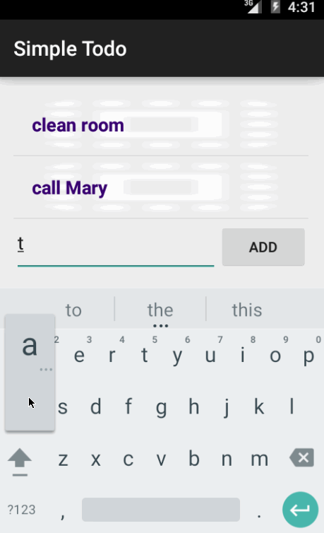

# Simple Todo Android App

This is an Android demo application for managing Todo items: add, edit, and delete items. See the [Todo App Tutorial](https://docs.google.com/a/thoughtworks.com/presentation/d/15JnmfmFa0hJOEkBhG_TeymChLzDzpOTJvBlOj29A9fY/edit#slide=id.gf45d6347_3_0) for a step-by-step tutorial for creating this app without the edit feature.

Time spent: 10 hours spent in total

Completed user stories:

 * [x] Required: User add todo items one-by-one.
 * [x] Required: User can delete a todo item by long clicking on an item.
 * [x] Required: User can edit a todo item by clicking on an item.

Notes:

Spent time on not allowing user to submit blank items, both from the main screen and from the edit screen. In addition, spent time on keyboard experience: keyboard should hide on the main screen when an item is successfully added, and when a user returns to that screen after editing an item.

Walkthrough of all user stories:

GIF created with [LiceCap](http://www.cockos.com/licecap/).