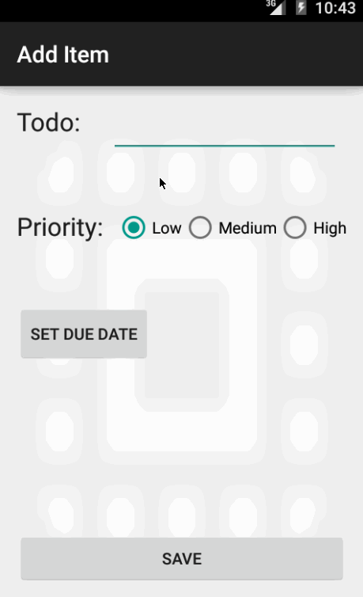

# Simple Todo Android App

This is an Android demo application for managing Todo items: add, edit, and delete items. See the [Todo App Tutorial](http://courses.codepath.com/snippets/intro_to_android/prework) for a step-by-step tutorial for creating this app.

Time spent: 14 hours spent in total

Completed user stories:

 * [x] Required: User add todo items one-by-one.
 * [x] Required: User can delete a todo item by long clicking on an item.
 * [x] Required: User can edit a todo item by clicking on an item.
 * [x] Optional: Use custom adapter for the items in the list.
 * [x] Optional: Persists todo items in SQLite.
 * [x] Optional: Adds optional due date to item.

Notes:

Spent time on the following:

* Not allowing user to submit blank items, both from the add screen and from the edit screen.
* Styling the item list in the main activity, as well as styling the edit activity.
* Ensuring that AddItemActivity's and EditItemActivity's shared view changes text on it for what makes sense to the action.
* Due date cannot be before today.
* Changes function of the return key on the keyboard to a 'done' key when editing the item's text.
* Able to clear date once set: long click on the displayed date from the AddItemActivity or EditItemActivity.

Walkthrough of all user stories:

GIF created with [LiceCap](http://www.cockos.com/licecap/).